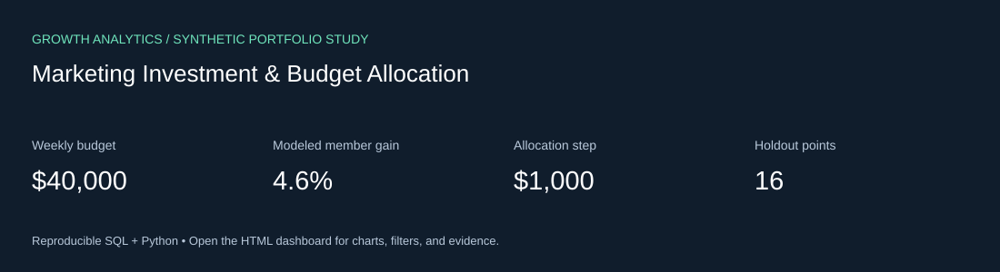

# Marketing Investment & Budget Allocation

Independent, AI-assisted marketing analytics project using **synthetic data** for a fictional fitness subscription business. No WHOOP affiliation or real campaign results are implied.



## Business question

Allocate a fixed media budget using fitted saturation curves, holdout validation and sensitivity analysis.

## Review the result

- [Decision brief](outputs/decision-brief.md): computed findings and business recommendations.
- [Interactive dashboard source](outputs/dashboard.html): download and open locally for charts, view selection, row search, metric selection, and CSV export. GitHub shows HTML source rather than running it.
- [SQL analysis](analysis.sql) and [Python pipeline](run.py).
- [Looker source and setup](bi/README.md), plus [Tableau build guide](bi/TABLEAU.md).

## Run locally

Requires Python 3.10+; **no packages, API keys or paid accounts are needed**.

```bash
git clone https://github.com/jahnavinalla1/marketing-budget-optimization.git
cd marketing-budget-optimization
python3 run.py
python3 -m unittest discover -s tests -v
```

Open `outputs/dashboard.html` in your browser. Generated data CSVs and the SQLite database are excluded from Git and rebuilt with a fixed seed. Committed output CSVs can be inspected immediately.

## Computed findings — simulated data

- The model projects 4.6% more incremental members than an equal $10,000-per-channel allocation at the same total spend. This is a scenario estimate, not an achieved improvement.
- Respect $4,000 channel floors and $16,000 caps; saturation prevents allocating everything to the channel with the lowest historical average CAC.
- Under the modeled response shocks, gains range from 2.46% to 5.16%. Approve a small, measured reallocation before scaling.
- Ask Growth Marketing to confirm inventory limits, Finance to confirm spend ceilings, and the measurement owner to supply real incrementality calibrations.

## Deliverables and status

| Deliverable | Status |
|---|---|
| Reproducible SQL/Python analysis | Executable and locally tested |
| Offline interactive dashboard | Generated with embedded computed data |
| Data-quality / numerical tests | See [validation record](VALIDATION.md) |
| Native LookML model, view, dashboard source | Supplied; needs warehouse connection and tenant validation |
| Tableau calculated fields and layout instructions | Supplied; workbook not built or published |
| Business recommendations | Hypothetical; no media spend executed |

The HTML report is the working dashboard. The repository does **not** claim a deployed Looker or Tableau dashboard. LookML is for Looker, not Looker Studio.

## Skill evidence

SQL, marketing measurement, visualization, analytical problem solving, explicit assumptions, business recommendations, and quality-checked AI assistance. The project supports review of relevant project experience; it does not establish degrees, years of professional work, prior stakeholder collaboration, or relocation availability.

Read [data contracts](DATA-DICTIONARY.md), [AI assistance](AI-ASSISTANCE.md), and [review questions](REVIEW-GUIDE.md). Rerun the analysis and explain it independently before claiming proficiency. [WHOOP's role](https://jobs.ashbyhq.com/whoop/e9c9fa1f-4711-4fa0-876a-eb9787ab77cf) inspired the skill coverage (reviewed October 1, 2026).

## Related independent repositories

- [Paid Media Performance & Acquisition](https://github.com/jahnavinalla1/paid-media-performance-analytics)
- [Paid Social Incrementality & Lift](https://github.com/jahnavinalla1/marketing-incrementality-lift)
- [Trusted Marketing Data & Reporting](https://github.com/jahnavinalla1/marketing-data-quality-reporting)
